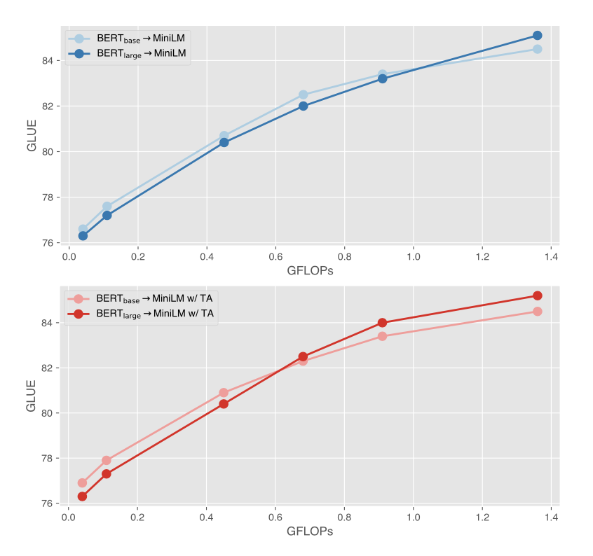

## MiniMoE

This repository contains code for ACL 2023 paper titled [Lifting the Curse of Capacity Gap in Distilling Language Models](https://arxiv.org/abs/2305.12129).

**************************** **Updates** ****************************

<!-- Thanks for your interest in our repo! -->

* 31/5/2023, we release our paper, code, and checkpoints, check them out!

## Quick Links

  - [Overview](#overview)
  - [Getting Started](#getting-started)
    - [Requirements](#requirements)
    - [Distillation](#distillation)
    - [Finetuning](#finetuning)
  - [Bugs or Questions?](#bugs-or-questions)
  - [Citation](#citation)

## Overview

Pretrained language models (LMs) have shown compelling performance on various downstream tasks, but unfortunately they require a tremendous amount of inference compute. Knowledge distillation finds a path to compress LMs to small ones with a teacher-student paradigm. However, when the capacity gap between the teacher and the student is large, a curse of capacity gap appears, invoking a deficiency in distilling LMs. While a few studies have been carried out to fill the gap, the curse is not yet well tackled. In this paper, we aim at lifting the curse of capacity gap via enlarging the capacity of the student without notably increasing the inference compute. Largely motivated by sparse activation regime of mixture of experts (MoE), we propose a mixture of minimal experts (MiniMoE), which imposes extra parameters to the student but introduces almost no additional inference compute. Experimental results on GLUE and CoNLL demonstrate the curse of capacity gap is lifted by the magic of MiniMoE to a large extent. MiniMoE also achieves the state-of-the-art performance at small FLOPs compared with a range of competitive baselines. With a compression rate as much as 50 times, MiniMoE preserves 95% GLUE score of the teacher.



## Getting Started

### Requirements

- crc32
- pytorch
- numpy
- transformers

### Distillation

**Wikipedia Data**

Download Wikipedia dump through the [link](https://dumps.wikimedia.org/enwiki/latest/enwiki-latest-pages-articles.xml.bz2). Process the dump with [wikiextractor](https://github.com/attardi/wikiextractor), which will convert the dump into this [format](https://github.com/attardi/wikiextractor/wiki/File-Format).

Format the processed Wikipedia to the format that aligns with the style of BERT pretraining, i.e., one sentence per line in one document, and one empty line between two documents. We provide example scripts of formatting the Wikipedia in `scripts/bert_format_wiki.sh`. We explain some importance arguments in the following:
* `--input_dir`: directory to input files.
* `--input_regex`: regex to enumerate input files in above `input_dir`.
* `--output_dir`: directory to save formatted files.
* `--num_processors`: num of precessors to conduct multiprocessing.

Build the formatted Wikipedia to TFRecords so that we could later read the data in a stream-like manner. This could help to save much cpu memory when we are faced with huge volume of data. This will build the Wikipedia to segment pairs used by BERT as `[CLS] segment A [SEP] segment B [SEP]`. We provide example scripts of building the Wikipedia in `scripts/bert_build_wiki.sh`. We explain some importance arguments in the following:
* `--input_dir`: same as above.
* `--input_regex`: same as above.
* `--output_dir`: same as above.
* `--tokenizer_name_or_path`: name or path to the tokenizer, used to tokenize the sentences.
* `--do_lower_case`: whether the sentences should be lower cased or not.
* `--max_seq_length`: the maximum sequenth length of the input, used to truncate the input if necessary.
* `--num_processors`: same as above.

:warning: As we build the Wikipedia with `max_seq_length=128` for its sufficiency in our concerned tasks (i.e., GLUE and CoNLL), subsequent distilled models should better be used with sequences whose lengths are smaller than or equal to `128`. 

**MiniLM**

We provide example scripts of distillation with MiniLM in `scripts/bert_minilm_3L_384H.sh`. We explain some importance arguments in the following:
* `--model_type`: model variant to use, should be `bert_minilm` here.
* `--teacher_model_name_or_path`: name or path to teacher model, e.g., `bert-base-uncased`, `bert-large-uncased`.
* `--student_model_name_or_path`: name or path to student model config, used as an initialization of student configuration.
* `--record_path_or_regex`: path or regex to builded TFRecords, e.g, `wikipedia_bert_128/wiki_*.format.tfrecord`.
* `--data_type`: data pipeline to use, should align with `model_type` and be `bert_nil` here. `bert_nil` stands for no operation when collating data, in contrast, `bert_mlm` stands for dynamic masking.
* `--layer`: num of layers for student cofiguration.
* `--hidden`: num of hiddens for student configuration.
* `--model_suffix`: identifier used to manage different models/experiments.

The checkpoints from `bert-base-uncased`, `bert-large-uncased`, and `bert-base-chinese` (distillation with [CLUECorpusSmall](https://github.com/CLUEbenchmark/CLUECorpus2020#cluecorpussmall14g) instead of Wikipedia) are offered as follows:

|Model|Checkpoint|Model|Checkpoint|Model|Checkpoint|
|--|--|--|--|--|--|
|bert-base-minilm-12L-384H|[huggingface](https://huggingface.co/GeneZC/bert-base-minilm-12L-384H)|bert-large-minilm-12L-384H|[huggingface](https://huggingface.co/GeneZC/bert-large-minilm-12L-384H)|N/A|N/A|
|bert-base-minilm-6L-384H|[huggingface](https://huggingface.co/GeneZC/bert-base-minilm-6L-384H)|bert-large-minilm-6L-384H|[huggingface](https://huggingface.co/GeneZC/bert-large-minilm-6L-384H)|bert-chinese-minilm-6L-384H|[huggingface](https://huggingface.co/GeneZC/bert-chinese-minilm-6L-384H)|
|bert-base-minilm-4L-384H|[huggingface](https://huggingface.co/GeneZC/bert-base-minilm-4L-384H)|bert-large-minilm-4L-384H|[huggingface](https://huggingface.co/GeneZC/bert-large-minilm-4L-384H)|bert-chinese-minilm-4L-384H|[huggingface](https://huggingface.co/GeneZC/bert-chinese-minilm-4L-384H)|
|bert-base-minilm-3L-384H|[huggingface](https://huggingface.co/GeneZC/bert-base-minilm-3L-384H)|bert-large-minilm-3L-384H|[huggingface](https://huggingface.co/GeneZC/bert-large-minilm-3L-384H)|bert-chinese-minilm-3L-384H|[huggingface](https://huggingface.co/GeneZC/bert-chinese-minilm-3L-384H)|

:warning: We also have a few checkpoints of other stuctures, you mau inquiry us if you are interested.

:ghost: The pipeline can be easily extended to other baselines such as TinyBERT and other backbones such as RoBERTa, check `models/bert_tinybert.py` and `models/roberta_minilm` for intuitions.

:space_invader: To extend MiniLM to larger BERT such as [bert-xlarge-chinese](https://huggingface.co/IDEA-CCNL/Erlangshen-MegatronBert-1.3B) in our paper (Appendix F), one should use a larger corpus such as [WuDao](https://en.wikipedia.org/wiki/Wu_Dao#cite_note-corpora-19), and use MegatronBert for the teacher, check `models/megatronbert_minilm.py` for insights.

**MiniLM w/ TA**

We provide example scripts of distillation with MiniLM w/ TA in `scripts/bert_minilm_12,3L_384H.sh`. The arguments are roughly the same as those in MiniLM. We further explain some additional arguments in the following:
* `--iteration`: current step of distillation, e.g., `iteration=1` when the teacher `bert-base-uncased` is distilled to the TA `bert_minilm_12L_384H`, and `iteration=2` when the TA is later distilled to the student `bert_minilm_3L_384H`.

:warning: Two rounds of distillation are needed to insert a TA between the teacher and the student. Be careful when setting `teacher_model_name_or_path` and `student_model_name_or_path`.

**MiniMoE**

We provide example scripts of distillation with MiniMoE in `scripts/moebert_minilm_3L_384H_1,4E.sh`. The arguments are roughly the same as those in MiniLM. We further explain some additional arguments in the following:
* `--moe`: num of experts for student configuration, in an `x,y` format, where `x` stands for num of attention experts and `y` stands for num of feedforward experts.

The checkpoints from `bert-base-uncased` and `bert-large-uncased` are offered as follows:

|Model|Checkpoint|Model|Checkpoint|
|--|--|--|--|
|bert-base-minimoe-6L-384H|[huggingface](https://huggingface.co/GeneZC/bert-base-minimoe-6L-384H)|bert-large-minimoe-6L-384H|[huggingface](https://huggingface.co/GeneZC/bert-large-minimoe-6L-384H)|
|bert-base-minimoe-4L-384H|[huggingface](https://huggingface.co/GeneZC/bert-base-minimoe-4L-384H)|bert-large-minimoe-4L-384H|[huggingface](https://huggingface.co/GeneZC/bert-large-minimoe-4L-384H)|
|bert-base-minimoe-3L-384H|[huggingface](https://huggingface.co/GeneZC/bert-base-minimoe-3L-384H)|bert-large-minimoe-3L-384H|[huggingface](https://huggingface.co/GeneZC/bert-large-minimoe-3L-384H)|

:warning: MiniMoE defaults to 1,4E settings.

**Sparse MiniLM**

:ghost: The method is primarily implemented for our previous work [MiniDisc](https://github.com/GeneZC/MiniDisc), which uncovers the optimal TA in minimally one trial against many trials from other studies. For sparse MiniLM, we need to sparsify the teacher first so that it could be used to initialize the student. The sparsification of attention heads and feedforward neurons is borrowed from [16Heads](https://arxiv.org/abs/1905.10650), [DynaBERT](https://arxiv.org/abs/2004.04037) and that of hidden states is borrowed from [CoFiPruning](https://arxiv.org/abs/2204.00408). The schedule of the sparsification among heads, neurons, and hiddens for a given sparsity is raise by us. The sparsification is carried out on a fraction of Wikipedia and parameter importance scores are estimated via the masked language modeling loss. With all designs above, we could reach a model as sparse as 99% sparsity yet with just fine performance. Please refer to `run_sparsification_bert.py` for details.

We provide example scripts of sparsification of BERT in `scripts/bert_sparse.sh`. We explain some importance arguments in the following:
* `--model_type`: model variant to use, should be `sparsebert_mlm` here.
* `--teacher_model_name_or_path`: name or path to to-be-sparsified model, e.g., `bert-base-uncased`, `bert-large-uncased`.
* `--record_path_or_regex`: path or regex to a fraction of builded TFRecords, e.g, `wikipedia_bert_128/wiki_00.format.tfrecord`.
* `--data_type`: data pipeline to use, should align with `model_type` and be `bert_mlm` here.

The checkpoint of `sparsebert-base` is offered as follows:

|Model|Checkpoint|
|--|--|
|sparsebert-base|[huggingface](https://huggingface.co/GeneZC/sparsebert-base)|

We provide example scripts of distillation with sparse MiniLM in `scripts/sparsebert_minilm_90S.sh`. The arguments are roughly the same as those in MiniLM. We further explain some additional arguments in the following:
* `--student_model_name_or_path`: name or path to student model config, should be `GeneZC/sparsebert-base` here.
* `--sparsity`: sparsity for student configuration.

The checkpoints from `bert-base-uncased` are offered as follows:

|Model|Checkpoint|
|--|--|
|sparsebert-base-minilm-90S|[huggingface](https://huggingface.co/GeneZC/sparsebert-base-minilm-90S)|
|sparsebert-base-minilm-95S|[huggingface](https://huggingface.co/GeneZC/sparsebert-base-minilm-95S)|
|sparsebert-base-minilm-98S|[huggingface](https://huggingface.co/GeneZC/sparsebert-base-minilm-98S)|
|sparsebert-base-minilm-99S|[huggingface](https://huggingface.co/GeneZC/sparsebert-base-minilm-99S)|

**Once-for-all MiniLM**

:ghost: The method is implemented just for fun, so use it at your own risk. It can produce many students with different structures in one run. This is well compatible with unifying sparse students. However, we would like to take a step further to unify dense students. Similar ideas could be found in other literature, e.g., [OFA](https://arxiv.org/abs/1908.09791), [HAT](https://arxiv.org/abs/2005.14187).

We provide example scripts of distillation with once-for-all MiniLM in `scripts/ofabert_minilm_6L_768H.sh`. The arguments are roughly the same as those in MiniLM. We further explain some additional arguments in the following:
* `--layer`: num of layers for the unified student configuration, e.g., 6.
* `--hidden`: num of hiddens for the unified student configuration, e.g., 768.
* `--ofa_layer`: num of layers for the sub-students configuration, e.g., 6,4,3.
* `--ofa_hidden`: num of hiddens for the sub-students configuration, e.g., 768,512,384,256,192.

The (all-in-one) checkpoint from `bert-base-uncased` is offered as follows:

|Model|Sub-models|Checkpoint|
|--|--|--|
|ofabert-base-minilm-6L-768H|{6,4,3}L x {768,512,384,256,192}H|[huggingface](https://huggingface.co/GeneZC/ofabert-base-minilm-6L-768H)|

### Finetuning

Please refer to our previous work [StarK](https://github.com/GeneZC/StarK/blob/main/run_finetuning.py) and [MiniDisc](https://github.com/GeneZC/MiniDisc/blob/main/run_distillation_ner.py) for finetuning on GLUE and CoNLL, respectively.

## Bugs or Questions?

If you have any questions related to the code or the paper, feel free to email Chen (`czhang@bit.edu.cn`). If you encounter any problems when using the code, or want to report a bug, you can open an issue. Please try to specify the problem with details so we can help you better and quicker!

## Citation

Please cite our paper if you use the code in your work:

```bibtex
@inproceedings{zhang2023minimoe,
   title={Lifting the Curse of Capacity Gap in Distilling Language Models},
   author={Zhang, Chen and Yang, Yang and Liu, Jiahao and Wang, Jingang and Xian, Yunsen and Wang, Benyou and Song, Dawei},
   booktitle={ACL},
   year={2023}
}
```

